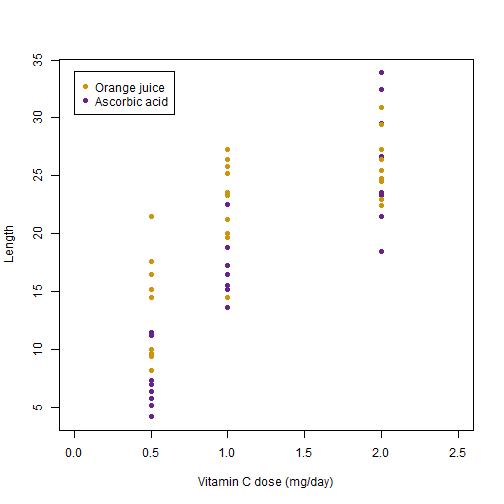

My Shiny app for Coursera Developing Data Product Course project 
========================================================
author: Luigi Bernardi
date: 24/04/2020
autosize: true

<style>
.reveal section h1 {
  font-size: 60px;
}
.reveal section p {
  font-size: 25px;
}
.reveal section ul {
  font-size: 25px;
}
.small-code pre code {
  font-size: 1em;
}
</style>

The app
========================================================

App is built to **predict the effect of vitamin C on tooth growth in guinea Pigs** fitting two different models on data taken from **ToothGrowth dataset** available in R dataset package.  
This dataset collect outcomes from an experiment in which response is the length of odontoblasts (cells responsible for tooth growth) in 60 guinea pigs. Each animal received one of three dose levels of vitamin C (0.5, 1, and 2 mg/day) by one of two delivery methods: orange juice or ascorbic acid.

- **Model 1** is a simple linear regression model with **length as response and daily dose as regressor**.
- **Model 2** is a multivariate linear regression model with **length as response and both daily dose and supplement type as regressors**.

Using the app, you can specify daily dose and supplement type and then visualize:

- summary of the models,
- scatterplot showing predictions,
- predicted tooth length values.

ToothGrowth dataset
========================================================

ToothGrowth dataset contains 60 observations and 3 variables:

- **len** (tooth length),
- **supp** (supplement type: VC or OJ),
- **dose** (dose in milligrams/day).

Plot show dose against length and display different supplementation with different colors.

***


Model 1: fitting and parameters
========================================================
class: small-code

This is the first model model used for prediction:


```r
lm1 <- lm(len ~ dose, data = ToothGrowth)
summary(lm1)
```

```

Call:
lm(formula = len ~ dose, data = ToothGrowth)

Residuals:
    Min      1Q  Median      3Q     Max 
-8.4496 -2.7406 -0.7452  2.8344 10.1139 

Coefficients:
            Estimate Std. Error t value Pr(>|t|)    
(Intercept)   7.4225     1.2601    5.89 2.06e-07 ***
dose          9.7636     0.9525   10.25 1.23e-14 ***
---
Signif. codes:  0 '***' 0.001 '**' 0.01 '*' 0.05 '.' 0.1 ' ' 1

Residual standard error: 4.601 on 58 degrees of freedom
Multiple R-squared:  0.6443,	Adjusted R-squared:  0.6382 
F-statistic: 105.1 on 1 and 58 DF,  p-value: 1.233e-14
```

Model 2: fitting and parameters
========================================================
class: small-code

This is the second model:


```r
lm2 <- lm(len ~ dose + supp, data = ToothGrowth)
summary(lm2)
```

```

Call:
lm(formula = len ~ dose + supp, data = ToothGrowth)

Residuals:
   Min     1Q Median     3Q    Max 
-6.600 -3.700  0.373  2.116  8.800 

Coefficients:
            Estimate Std. Error t value Pr(>|t|)    
(Intercept)   9.2725     1.2824   7.231 1.31e-09 ***
dose          9.7636     0.8768  11.135 6.31e-16 ***
suppVC       -3.7000     1.0936  -3.383   0.0013 ** 
---
Signif. codes:  0 '***' 0.001 '**' 0.01 '*' 0.05 '.' 0.1 ' ' 1

Residual standard error: 4.236 on 57 degrees of freedom
Multiple R-squared:  0.7038,	Adjusted R-squared:  0.6934 
F-statistic: 67.72 on 2 and 57 DF,  p-value: 8.716e-16
```


